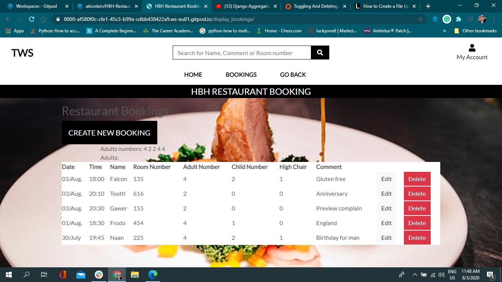

Created by Attila Szaloki Code Institute Alumnus

**Django Bookig system**

"This project was planned to use in a hotel restaurant for taking booking via form. Form-field imformations requested by Restaurant Manager and 
immediet list rendered for printed version."

**Data Storage**

Input data stored in Postgres

**Deployment**

"Project deployed to Heroku"

<a href="https://hbh-restaurant-booking.herokuapp.com/" target="_blank">HBH Restaurant Booking</a>
