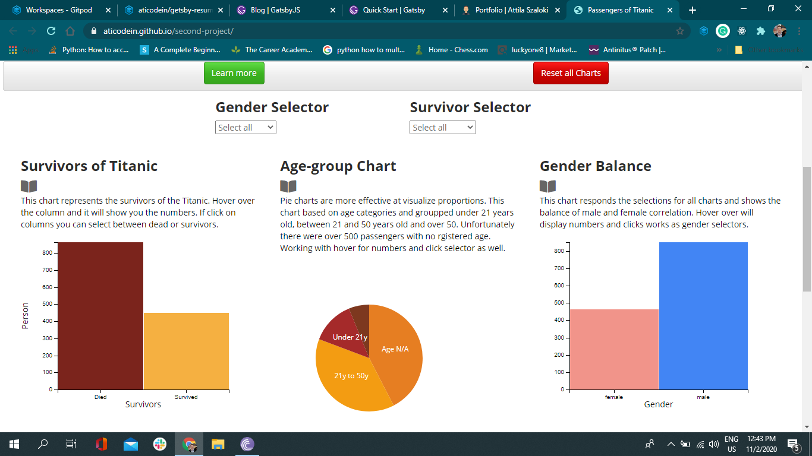

Titanic Passangers Data Dashboard

**Hosted by Github**

The page uses the D3.js library with the DC.js and crossfilter.js libraries to present the data via a series of bar and pie charts, keep the data analysis clear and simple.

This is a single page dashboard represents the data of the passengers of the Titanic. Users can hover over and click on charts and selectors, to make their own selected groups and compare to an other group.

**Technologies Used**

HTML5 & CSS3
HTML5 & CSS3 were used to create the layout and styling of this site
Code validators were used to check for errors with the HTML and CSS
AWS Cloud9
Cloud9 IDE editor used to write the HTML, CSS and JavaScript.
Bootswatch 3.4.0 (Spacelab
JavaScript and selected external libraries have been used throughout this site, in the following ways:
For the creation and manipulation of the data-visualization elements
DC.js
Crossfilter.js
D3-queue.js was used to load files.
jQuery was used to assist with DOM manipulation when resetting filters and showing / hiding selected sections.
Font Awesome

Github repository : https://github.com/aticodein/second-project

Deployed Gihub Pages : https://aticodein.github.io/second-project/