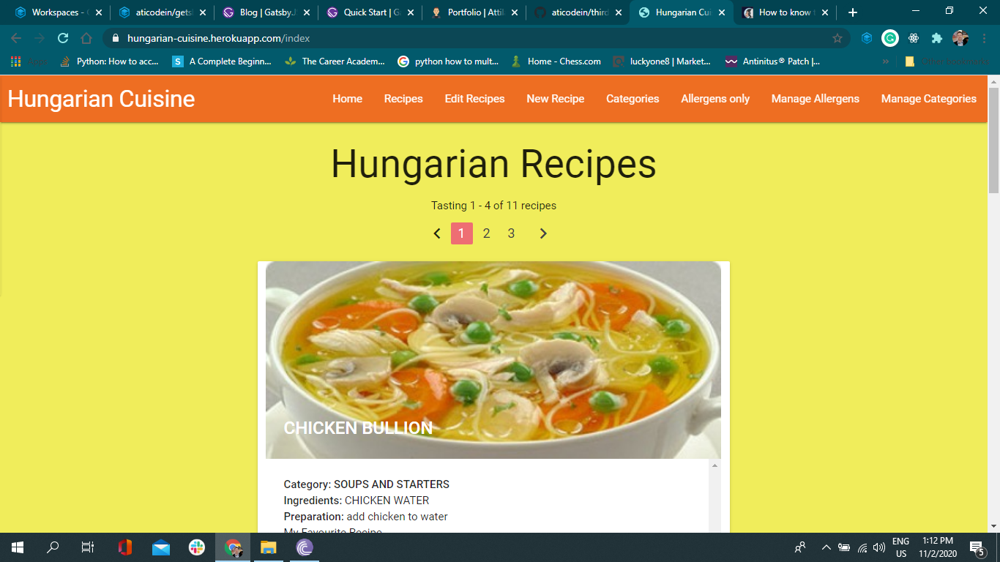

This project only for demonstrate the usage of Python language helped by Flask and Jinja and build an interactive application for certain functionality.

**Data-Centric Development**

Created with Python, Flask and MnogoDB and the purpose of this project is to create an interactive website with database of recipes that allows the user to create, read, update and delete (CRUD) recipes.

**As always used Git version control**

Techologies:

For CSS grid I used Materialize framework and its JQuery.
For data transfer Falsk, Jinja, pyMongo and for storage Atlas MongoDB
Back-end language is Python. The recipe filter by categories and recipes pagination are the two functionality for demonstrate the understanding the python language and its logic.

"Project deployed to Heroku"

<a href="https://hungarian-cuisine.herokuapp.com/" target="_blank">HBH Restaurant Booking</a>

Github repository: https://github.com/aticodein/third-project