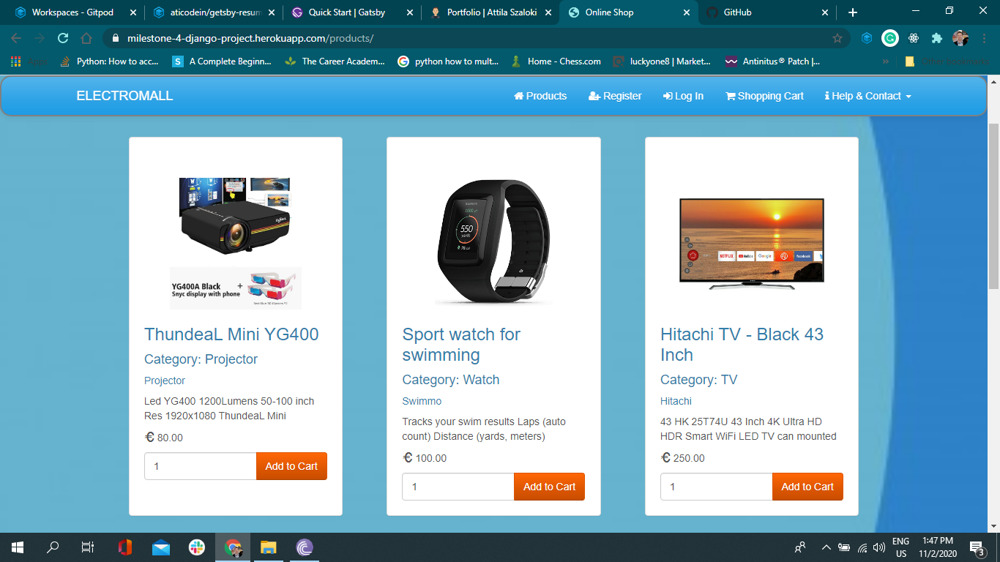

E-commerce project deployed on Heroku and Stripe payment method integrated

**Fullstack Django project**

This project is an online webshop for electronics. Selected products held in shopping cart for one session. Login, logout authentication for shopping with stripe payments.

A very simple presentation of a working webshop, easily attached to a technichal blog for introduce new products to readers. Its simplicity good for around 50 items easily browsing with category and pagination.

**Technologies Used**

This project uses HTML, CSS, JavaScript and Python computer languages. JQuery, Bootstrap, Django frameworks. SQLite and AWS databases. Gitpod for developing, Github repositories for store code and Heroku deployment.

AWS buckets stores data for Heroku
Django with Python
Back-end framework very useful inbuilt fetures specially Admin site.
Gitpod cloud developing

<a href="https://github.com/aticodein/django-milestone" target="_blank">Github Repository</a>

<a href="https://milestone-4-django-project.herokuapp.com/" target="_blank">Electromall e-commerce website</a>